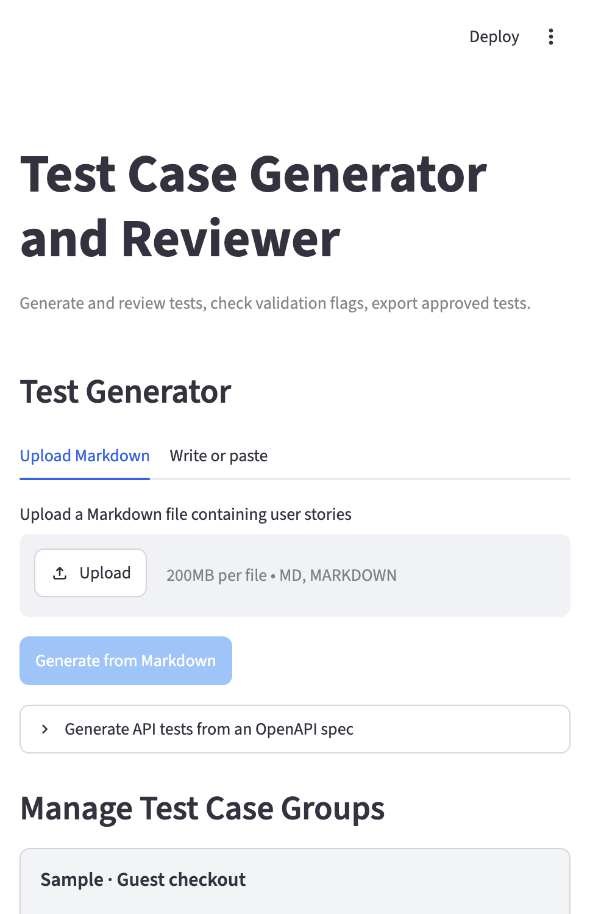
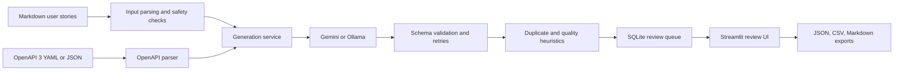

# Test Case Generator

Turn user stories and OpenAPI 3 specifications into reviewable test cases.
The Streamlit app generates functional, negative, edge, boundary, and API cases
with Gemini or a local Ollama model, then stores them in a SQLite review queue
for human review and export.

## The problem

Writing thorough tests from product requirements is time-consuming, and
AI-generated cases need validation and human review before use. This project
generates structured cases with expected results paired to every step, flags
likely duplicates and low-value cases, and keeps approval and export under
reviewer control.

## App preview



## Architecture



## Quickstart

Requires Python 3.10 or later and a Gemini API key, or a locally running Ollama
installation.

```sh
python -m pip install -r requirements.txt
```

Set the provider in `.env` (or in your shell). For Gemini:

```dotenv
LLM_PROVIDER=gemini
LLM_API_KEY=your-gemini-api-key
```

Start the app:

```sh
python -m streamlit run app.py
```

In **Test Generator**, paste a story or upload one of the included Markdown
samples. Each story can generate up to 10 cases total across its categories.
Cases are saved to the local `output/review_queue.sqlite3` database, where you
can filter, review, accept, reject, edit, and export them.

To try the API workflow, upload [`petstore_openapi.yaml`](./samples/petstore_openapi.yaml)
under **Generate API tests from an OpenAPI spec**.

### Sample inputs

The [`samples/`](./samples/) folder contains:

- [`example_user_story001.md`](./samples/example_user_story001.md) — guest checkout.
- [`example_user_story002.md`](./samples/example_user_story002.md) — transaction round-ups.
- [`example_user_story003.md`](./samples/example_user_story003.md) — bulk role updates.
- [`example_user_story004.md`](./samples/example_user_story004.md) — accessible analytics.
- [`example_user_story005.md`](./samples/example_user_story005.md) — collaborative editing.
- [`petstore_openapi.yaml`](./samples/petstore_openapi.yaml) — a small API contract.

Stories in one uploaded Markdown file become separate Test Case Groups, each
with its own 10-case maximum.

## Tests and evaluation

Run the offline suite locally:

```sh
python -m pip install -r requirements.txt
python -m pytest -q
```

GitHub Actions runs this command on pushes, pull requests, and manual dispatch.
The suite covers schema validation, expected-result/step pairing, deduplication,
quality heuristics, storage, OpenAPI parsing, and exports. LLM calls are mocked,
so tests do not require credentials or incur API usage.

Latest local result: **93 tests passed**. This is a deterministic software test
result, not a benchmark of generated-case quality; no live-model quality
evaluation has been conducted yet.

## Limitations and roadmap

- Generated cases can be incomplete or incorrect; review them before using them.
- Duplicate and low-value checks are heuristics and can produce false positives
  or miss issues.
- Model output varies by provider and model. Live-model quality and cost are not
  currently benchmarked.
- Story content is sent to the configured provider. Avoid secrets and sensitive
  data; input safety checks are heuristic, not a security boundary.
- OpenAPI support targets version 3 and currently resolves local references.
- Next steps: add a repeatable live-model evaluation set, capture a short UI
  demo, and optionally deploy a public demo with non-sensitive sample data.

## Run with Gemini

The command-line generator remains available for Markdown stories:

```sh
python -m testgen.generate samples/example_user_story001.md all
```

Generated cases are written to `output/generated.json`. Each case includes
flags for likely duplicates within the same story and low-value cases, such as
vague expected results, fewer than two meaningful steps, or boundary tests
without concrete test data. These flags are prompts for review, not automatic
rejections. Cases are also persisted in the SQLite review queue at
`output/review_queue.sqlite3`, so generation results remain available after
restarting the app.

Temporary Gemini 503 availability errors are retried with backoff. If the
service remains unavailable after retries, generation automatically falls back
to Ollama. Start Ollama and download the configured model for this fallback to
work. Gemini configuration errors, such as an invalid API key, are reported
without falling back. Keep `LLM_PROVIDER=gemini` and configure `OLLAMA_BASE_URL`
and `OLLAMA_MODEL` to enable this fallback; setting `LLM_PROVIDER=ollama` uses
Ollama directly instead.

## Review queue operations

Use the storage API to inspect and review saved cases. IDs are assigned by
SQLite and remain stable across generation runs:

```python
from testgen.storage import (
    accept_review_item,
    edit_review_item,
    list_review_items,
    reject_review_item,
)

items = list_review_items()
accept_review_item("TC-001")
reject_review_item("TC-002")

updated_case = items[2].test_case.model_copy(
    update={"title": "More specific test title"}
)
edit_review_item(items[2].id, updated_case)
```

Saving edits returns the item to `pending` and marks it as manually edited.
The manual-edit marker is shown separately from its review status and included
as its own overview counter. Existing database rows with the former `edited`
status are migrated to pending with the marker preserved.

## Export approved tests

The review UI provides JSON, CSV, and Markdown downloads containing only
accepted cases. Manually edited cases must be accepted before export. The same
formats are available from Python:

```python
from testgen.exports import export_csv, export_json, export_markdown
from testgen.storage import list_review_items

items = list_review_items()
json_data = export_json(items)
csv_data = export_csv(items)
markdown_data = export_markdown(items)
```

## Run the review UI

Install project dependencies, then start Streamlit from the project root:

```sh
python -m pip install -r requirements.txt
python -m streamlit run app.py
```

The review page reads the same `output/review_queue.sqlite3` database used by
generation. Filter the queue by status or category, inspect validation flags,
and accept, reject, or edit each saved case. User-story generated cases are
organized into expandable Test Case Groups. Pending and rejected cases can be
permanently deleted individually; groups can be permanently deleted after a
strong confirmation, including all accepted cases in the group.

To generate from user stories in the app, use the **Test Generator** section.
Upload a Markdown file containing one or more stories, or enter a title and
paste a single story. Generated cases are appended to the existing review queue;
prior review decisions are not replaced.
Each story in an uploaded Markdown file becomes its own Test Case Group, named
with the uploaded filename followed by the story title. Group names can be
changed from the review page. Exports can include accepted cases from all groups
or from one selected group.

Each test case has one expected result per step. If generated output violates
this rule, the app asks the model to correct the response and retries validation
up to three times. If a category still fails validation, cases from successful
categories are saved to the test case group and the app reports the incomplete
generation. When editing a case, enter steps and expected results on separate
lines in matching order. The JSON and CSV exports preserve both lists, and the
Markdown export numbers the matching pairs.
Each user story generates at most 10 test cases across all categories; stories
in the same Markdown file each have their own limit. Tests should use a few
meaningful steps to cover a complete interaction when appropriate.

Story titles are limited to 200 characters and story text to 900 characters.
Typed stories and Markdown uploads are checked for common SQL-injection,
script, and shell-command payload patterns and rejected when detected. Describe
security requirements in plain language rather than pasting executable payloads.
These checks are heuristic and cannot identify every possible malicious input.
Stories are sent to the configured LLM provider, so do not include secrets or
sensitive data.

## Generate tests from OpenAPI

Upload an OpenAPI 3 YAML or JSON file in the review app under **Generate API
tests from an OpenAPI spec**. The generator creates API-category tests for each
HTTP operation that defines a 2xx response, preserving its method, path, request
body contract, and expected success status from the spec.

Try it with the included [Pet Store sample](./samples/petstore_openapi.yaml).

You can also generate from the command line:

```sh
python -m testgen.generate --openapi samples/petstore_openapi.yaml
```

Generated API tests are added to the same SQLite review queue and can be
reviewed and exported like story-based cases. Operations without a defined 2xx
response are reported rather than assigning an invented success status.

## Run with Ollama

1. Install and start [Ollama](https://ollama.com/download).
2. Check which models are already installed:

   ```sh
   ollama list
   ```

3. Set these values in `.env`:

   ```dotenv
   LLM_PROVIDER=ollama
   OLLAMA_BASE_URL=http://localhost:11434
   OLLAMA_MODEL=phi4-mini
   ```

   The Gemini API key is not used with Ollama.
4. Run the same generation command:

   ```sh
   python -m testgen.generate samples/user_stories.md US-01
   ```

The default model is `phi4-mini`. Change `OLLAMA_MODEL` to another model shown
by `ollama list`, or change `OLLAMA_BASE_URL` if Ollama is running on a
different host. If no model is installed, download one first:

```sh
ollama pull <model-name>
```